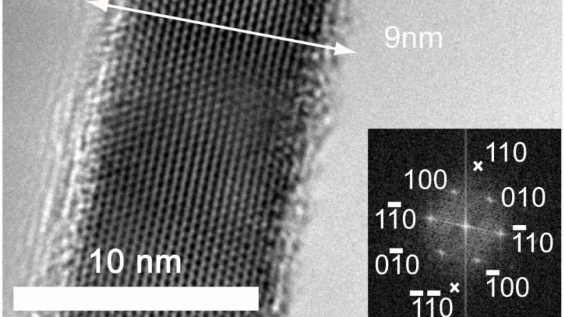
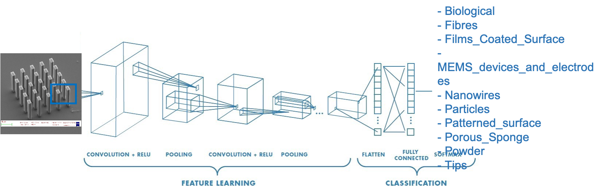
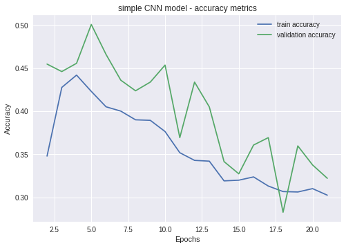
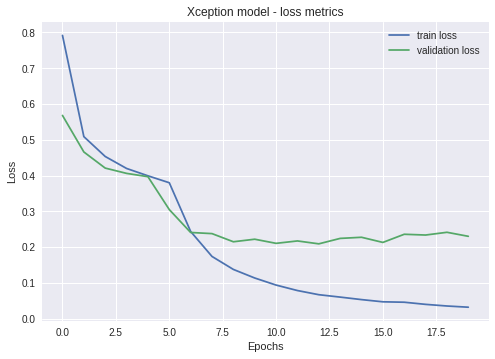
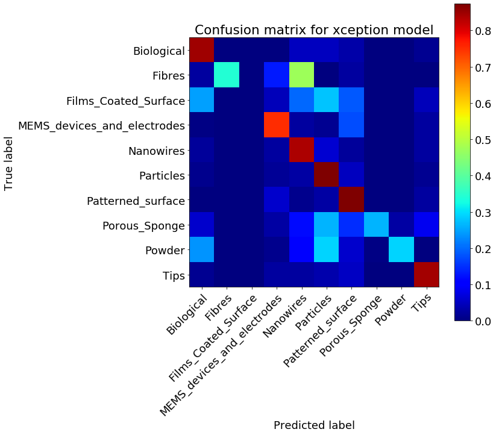
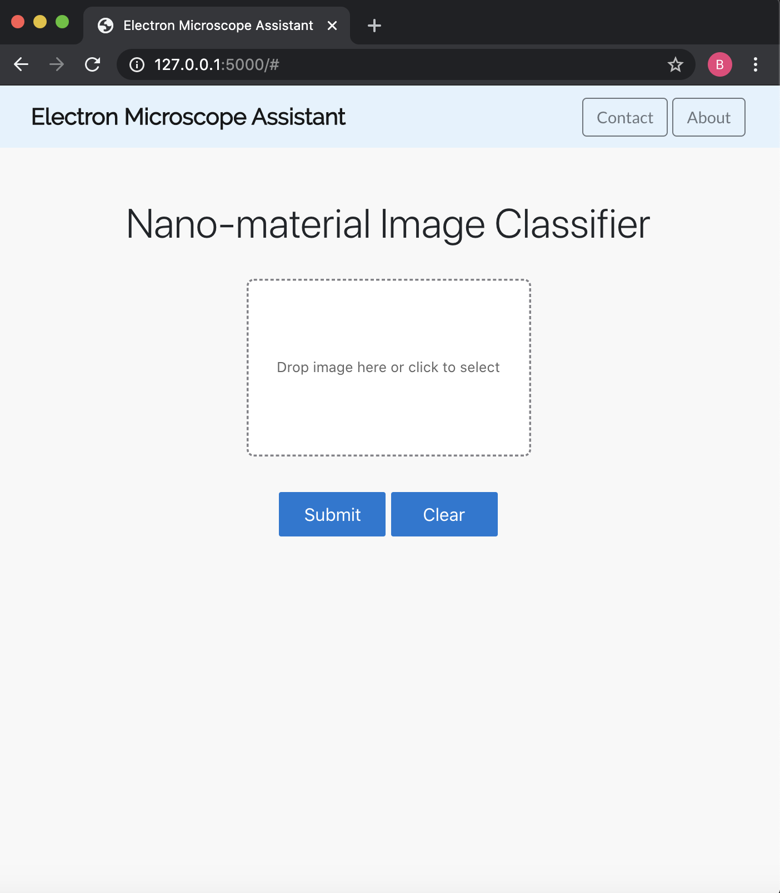

# Electron Microscope Assistant - A Convolution Neural Network Image Classifier

Ben Weintraub, Ph.D.

<a href="https://www.linkedin.com/in/benweintraub-phd/">LinkedIn profile</a>

<a href="https://docs.google.com/presentation/d/1GsfuGpNfm7nJ1Ozkt2XknCrtvMZXQcTfl0kLpUWExyM/edit?usp=sharing"> Link to slide deck presentation</a>

|

## Table of Contents

- <a href="https://github.com/b-weintraub/electron-microscope-assistant#background">Background</a>  
- <a href="https://github.com/b-weintraub/electron-microscope-assistant#Dataset">Dataset</a> 
- <a href="https://github.com/b-weintraub/electron-microscope-assistant#Exploratory-Data-Analysis">Exploratory Data Analysis</a>  
- <a href="https://github.com/b-weintraub/electron-microscope-assistant#Models">Models</a> 
- <a href="https://github.com/b-weintraub/electron-microscope-assistant#Discussion/Conclusion">Discussion/Conclusion</a>

## Background

Electron microscopes (EMs) such as transmission electron microscopes (TEMs) and scanning electron microscopes (SEMs) are useful for probing matter at magnifications beyond what’s possible using light microscopes, whose resolution is limited by the abbe diffraction limit. EMs can achieve sub-nanometer resolutions and are useful for characterizing nano-materials, or materials with dimensions on the order of billionths of a meter.  However, EMs are complex instruments requiring ultra-high vacuum systems and are thus expensive to operate.  It would be useful to develop methods to reduce the length of time required to analyze samples and increase sample analysis throughput.  Electron microscopists spend much of their time searching for target samples on the substrate as this process can be likened to “finding a needle in a haystack”.

This project looks for ways to automate parts of the electron microscopy process by using neural networks to identify nano-materials from scanning electron microscope images. It focuses on classifying nano-materials based on their morphology or shape.

## Dataset

The dataset contains 21,283 scanning electron microscope (SEM) images produced at the Italian Institute of Materials, CNR (https://b2share.eudat.eu/records/80df8606fcdb4b2bae1656f0dc6db8ba).  The images were broken up into 10 categories as shown in the below table.

## Exploratory Data Analysis

| category     | Number of images |
| ------------- |:-------------:| 
| Biological | 973    |
| Fibres | 163    |   
| Films_Coated_Surface      |327     |
| MEMS_devices_and_electrodes  | 4591     |
| Nanowires  | 3821     |
| Particles  | 3926     |
| Patterned_surface  | 4756     |
| Porous_Sponge  | 182     |
| Powder  | 918     |
| Tips  | 1625     |

Here are some representative images of each of the 10 categories.

Although the images are grayscale, they contain a color metadata tagthey and are encoded in 3 RGB channels. The metadata tag includes magnification, stage tilt angle, working distance, etc.  The tag was not removed. 

# Data preprocessing

The data was split into 70% training, 20% validation and 10% holdout and uploaded to an AWS S3 bucket for later processing on an EC2 instance.  Training image data were augmented by transformations including rotation, width/height shift, shearing and zoom to make model less susceptible to overfitting.

## Models

A convolution neural network (CNN) was the best choice for this dataset because they are uniquely suited to finding features in images. Generally, images are represented as tensors, or multi-dimensional arrays. Convolution, Rectified Linear Unit, and Max Pooling are three types of transformations commonly chained together in CNNs. Convolution is an operation that identifies which regions of an image have a feature by combining an image and a filter to create a new image.  The rectified linear unit (ReLU),an activation function, highlights only the region where the feature exists. Lastly, max pooling downsamples the resulting information to lower resolution to save space and computation. 

After feature learning, the next step is classification. A layer is added to flatten the 2-D data resulting in a fully connected layer containing all final numeric features which are linear combinations of the higher level features from the last convolutional layer. Lastly, an output layer is added with 10 classes, one for each label, and a softmax activation function is used to determine the final classification.

## Training
To handle the heavy processing, all computing was performed on an AWS EC2 instance (32 vCPU, 128 GiB memory). The model was training for 20 epochs.  Tensorboard was used to monitor the progress of the models. The model was trained by minimizing a cross entropy loss function. Accuracy and loss was tabulated for each epoch and saved to a log file using tensorboard.  

Here is sample code for the simple CNN.

    
    nb_filters = 32
    kernel_size = (3, 3)
    pool_size = (2, 2)
    model = Sequential()
    # 2 convolutional layers followed by a pooling layer followed by dropout
    model.add(Convolution2D(nb_filters, kernel_size,
                            padding='valid',
                            input_shape=input_size))
    model.add(Activation('relu'))
    model.add(Convolution2D(nb_filters, kernel_size))
    model.add(Activation('relu'))
    model.add(MaxPooling2D(pool_size=pool_size))
    model.add(Dropout(0.25))
    # transition to an mlp
    model.add(Flatten())
    model.add(Dense(128))
    model.add(Activation('relu'))
    model.add(Dropout(0.5))
    model.add(Dense(n_categories))
    model.add(Activation('softmax'))

The simple CNN model performed poorly with an accuracy of 50%.  To improve performance, next transfer learning was employed.

# Transfer learning - Xception model

Transfer learning is a technique that takes a model trained on one task and re-purposes it on a second related task. This study uses the Xception model, a pre-made architecture previously trained on the massive ImageNet dataset. In this way, the final output layer of the neural network is replaced with the output layer corresponding to the new data from the SEM images and is fine-tuned to predict on this new data. Xception has 134 layers with 36 convolutional layers. It takes advantage of depthwise separable convolutions, leading to increased classification accuracy and computational efficiency (Chollet 2017).  

 Generally speaking, gradient descent minimizes some function by iteratively moving in the direction of steepest descent as defined by the negative of the gradient. The learning rate determines the size of the steps we take to reach a (local) minimum. In other words, we follow the direction of the slope of the surface created by the function downhill until we reach a valley. In this study, a gradient descent-based RMSprop optimizer was used with a low learning rate of 0.001.
 

## Results

Using the Xception model, an accuracy of 94% is achieved.  Below are the accuracy and loss results for both the simple and Xception models.

<table>
    <tbody><tr><th></th>
    <th></td></th>
    </tr><tr>
        <td></td>
        <td></td>
    </tr>
</tbody></table>

A confusion matrix was generated to see where the model was mislabeling the classes.  Most commonly, Patterned_surface was confused for MEM_devices_and_electrodes.  This is reasonable since many MEMS devices and electrodes are generated from patterned surfaces.

Commonly confused categories

| category     | confused for | % |
| ------------- |:-------------:|:-------: |
| Patterned_surface | MEMS_devices_and_electrodes    | 2.26%|
| Particles | Nanowires    |  0.55% |
|   Particles    |Films_Coated_Surface     | 0.43%|
|  Nanowires | Biological    | 0.37%|
|  Nanowires | Films_Coated_Surface     |0.30%|

## Flask web app

A web app was built using flask in order to allow users to classify their own electron microscope images.  The Xception model was saved as a hdf5 file and predictions were made through a dockerized flask app. Below is a screenshot of the app.

<td></td>

## App demonstration

Here is a quick live demonstration of the app. 

  
# Discussion/Conclusion

A 94% accurate electron microscope image classifier was successfully demonstrated using transfer learning based on the Xception model. Some of the challenges with working with microscopy images is encoding the magnification.  For example, a 1-D fiber looks similiar to a 1-D nanowire depending on the magnification.  It's important for the model to encode magnfication data.  In this study, magnification data was imbedded as the meta data tag on the image.  However, it would be useful to encode this along with other metadata in separate channels. 

This study focuses primarily on material morphology.  However, electron microscopes can also gather chemical information via Energy Dispersive X-Ray Spectroscopy (EDXS) and structural information via electron diffraction. It would be useful encode this information as well in separate channels to provide additional predictive power for the model.

It would also be interesting to implement the model using a live video feed through openCV to try to incorporate real-time analysis during electron microscopy.  

## Tech stack used

<td></td>

## References

Aversa, R., Modarres, M., Cozzini, S. et al. The first annotated set of scanning electron microscopy images for nanoscience. Sci Data 5, 180172 (2018). 
https://www.nature.com/articles/sdata2018172

F. Chollet, "Xception: Deep Learning with Depthwise Separable Convolutions," 2017 IEEE Conference on Computer Vision and Pattern Recognition (CVPR), Honolulu, HI, 2017, pp. 1800-1807, doi: 10.1109/CVPR.2017.195.
https://arxiv.org/pdf/1610.02357.pdf

Header image (HRTEM nanowire)
https://cns1.rc.fas.harvard.edu/electron-microscopy/

