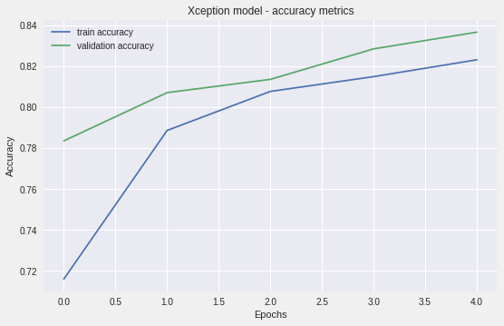
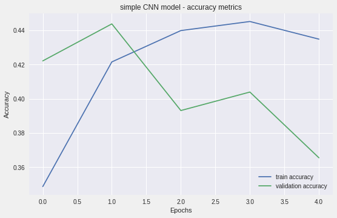
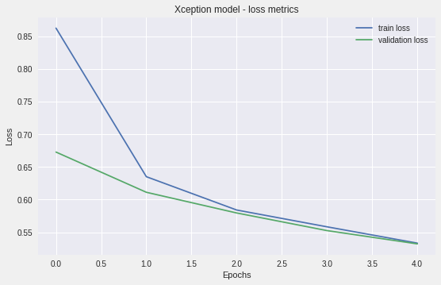
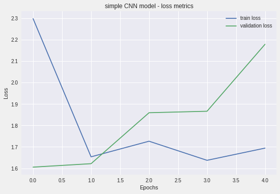

# Electron Microscope Assistant

Ben Weintraub, Ph.D.

<a href="https://www.linkedin.com/in/benweintraub-phd/">LinkedIn profile</a>

## Table of Contents

- <a href="https://github.com/b-weintraub/electron-microscope-assistant#background">Background</a>  
- <a href="https://github.com/b-weintraub/electron-microscope-assistant#Dataset">Dataset</a> 
- <a href="https://github.com/b-weintraub/electron-microscope-assistant#Exploratory-Data-Analysis">Exploratory Data Analysis</a>  
- <a href="https://github.com/b-weintraub/electron-microscope-assistant#Machine-Learning-Models">Machine Learning Models</a> 
- <a href="https://github.com/b-weintraub/electron-microscope-assistant#DiscussionNext-steps">Discussion/Next steps</a>

## Summary

## Background

## Dataset

The dataset contains 21,283 scanning electron microscope (SEM) images produced at Institute of Materials, CNR (https://b2share.eudat.eu/records/80df8606fcdb4b2bae1656f0dc6db8ba)

| category     | Number of images |
| ------------- |:-------------:| 
| Biological | 973    |
| Fibres | 163    |   
| Films_Coated_Surface      |327     |
| MEMS_devices_and_electrodes  | 4591     |
| Nanowires  | 3821     |
| Particles  | 3926     |
| Patterned_surface  | 4756     |
| Porous_Sponge  | 182     |
| Powder  | 918     |
| Tips  | 1625     |

## Exploratory Data Analysis

## Discussion/Next steps

    <td></td>
    <td></td>
    

<td></td>
<td></td>

<td></td>

Commonly confused categories

| category     | confused for | % |
| ------------- |:-------------:|:-------: |
| Patterned_surface | MEMS_devices_and_electrodes    | 3.80%|
| Powder | Biological    |  3.11% |
|   Patterned_surface    |Particles     | 1.87%|
|  Particles | Nanowires    | 1.45%|
|  Powder | Nanowires     |1.38%|

## Flask web app

<td></td>

  

## References

